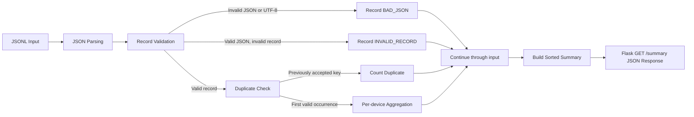
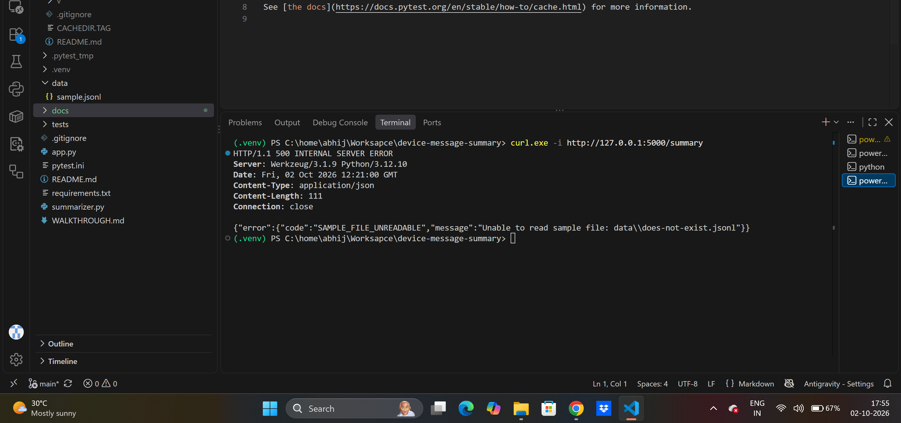
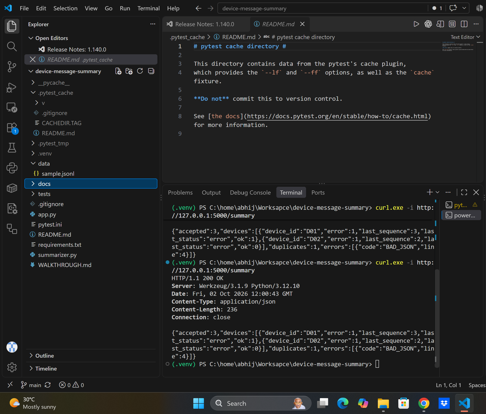
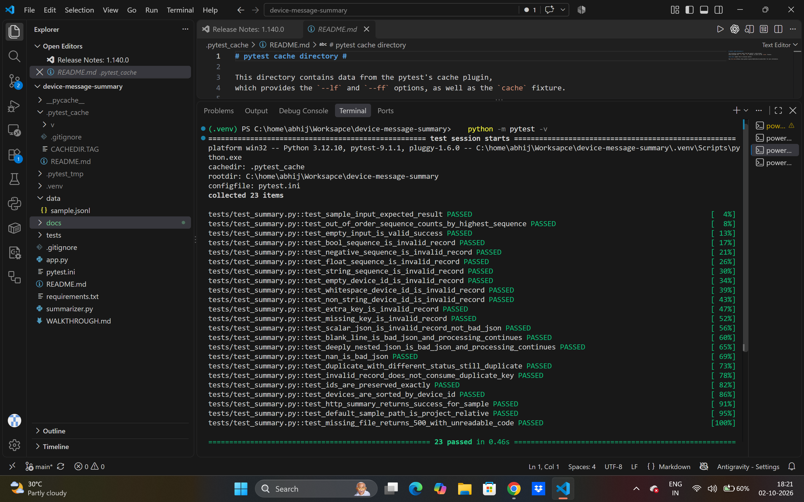

# Device Message Summary

A small Python and Flask application that reads synthetic device messages from a JSON Lines file and returns a
validated, deduplicated per-device summary through an HTTP endpoint.

## Table of Contents

1. [Overview](#1-overview)
2. [Architecture & Processing Flow](#2-architecture--processing-flow)
3. [Repository Structure](#3-repository-structure)
4. [Requirements](#4-requirements)
5. [Installation](#5-installation)
6. [Running the Application](#6-running-the-application)
7. [Input Format](#7-input-format)
8. [Processing Rules](#8-processing-rules)
9. [API Reference](#9-api-reference)
10. [Sample Input & Expected Output](#10-sample-input--expected-output)
11. [Verification Evidence](#11-verification-evidence)
12. [Testing](#12-testing)
13. [Failure Handling](#13-failure-handling)
14. [Assumptions](#14-assumptions)
15. [Known Limitation](#15-known-limitation)
16. [Out of Scope](#16-out-of-scope)
17. [Design Choice & Defect Fixed](#17-design-choice--defect-fixed)
18. [AI / Reuse Disclosure](#18-ai--reuse-disclosure)
19. [React Integration Notes](#19-react-integration-notes)

## 1. Overview

The program processes one simulated device message per JSONL line. It validates records, detects duplicate
`(device_id, sequence)` pairs, aggregates accepted `ok` and `error` messages by device, and returns the summary as
JSON from a Flask endpoint. The project is intentionally small and uses a local sample file rather than a database
or external service.

## 2. Architecture & Processing Flow

The summary logic is implemented in `summarizer.py`, independently of Flask. `app.py` reads the configured file
for each request, calls the summarizer, and returns the resulting JSON.



## 3. Repository Structure

| Path | Purpose |
| --- | --- |
| `app.py` | Flask application and `GET /summary` endpoint. |
| `summarizer.py` | Byte-oriented JSONL parsing, validation, duplicate detection, and aggregation. |
| `data/sample.jsonl` | Five-line synthetic input used by the example. |
| `tests/test_summary.py` | Unit and HTTP endpoint tests. |
| `requirements.txt` | Direct dependencies: Flask and pytest. |
| `pytest.ini` | Pytest options, including the project-local temp directory and import path. |
| `docs/evidence/` | Captured pytest and HTTP command output. |
| `docs/screenshots/` | Screenshots of HTTP responses and pytest output. |
| `WALKTHROUGH.md` | Short presentation script for demonstrating the project. |

## 4. Requirements

- Python 3.9+
- `pip`
- Flask and pytest, installed from `requirements.txt`

No other direct application dependencies are declared.

## 5. Installation

Run from the repository root.

### Windows PowerShell

```powershell
python -m venv .venv
.\.venv\Scripts\Activate.ps1
python -m pip install -r requirements.txt
```

### macOS/Linux

```bash
python3 -m venv .venv
source .venv/bin/activate
python -m pip install -r requirements.txt
```

## 6. Running the Application

Start the Flask development server from the repository root:

```powershell
python app.py
```

By default, the app reads `data/sample.jsonl` relative to `app.py`. To use another input file, set `SAMPLE_FILE`
before starting the app. An explicitly set value is used as provided.

```powershell
$env:SAMPLE_FILE="data\another-file.jsonl"
python app.py
```

The configured file is read for each endpoint request.

## 7. Input Format

Each line is expected to contain a JSON object with exactly these fields:

```json
{"device_id": "D01", "sequence": 1, "status": "ok"}
```

| Field | Accepted values |
| --- | --- |
| `device_id` | Non-empty, non-whitespace-only string. Valid IDs are preserved exactly as supplied. |
| `sequence` | Integer greater than or equal to zero; booleans are not accepted as integers. |
| `status` | Exactly `"ok"` or `"error"`. |

## 8. Processing Rules

- The file is read as bytes, split on LF, and each line is decoded as UTF-8 separately.
- Malformed JSON, invalid UTF-8, blank or whitespace-only lines, and `NaN`, `Infinity`, or `-Infinity` are
  `BAD_JSON`.
- Valid JSON that does not meet the record schema is `INVALID_RECORD`. Errors include 1-based line numbers, remain
  in input order, and do not stop processing.
- Records are validated before duplicate detection. An invalid record cannot reserve a duplicate key.
- The duplicate key is exactly `(device_id, sequence)`. The first valid occurrence is accepted; later occurrences
  count as duplicates even if their status differs.
- Duplicates do not affect accepted totals or device counts.
- Each accepted record increments its device’s `ok` or `error` count. `last_sequence` and `last_status` are based
  on the highest accepted sequence, not arrival order.
- Devices in the result are sorted by `device_id`.

## 9. API Reference

### `GET /summary`

Request:

```powershell
curl.exe -sS -i http://127.0.0.1:5000/summary
```

On successful processing, the endpoint responds with HTTP 200 and a JSON summary containing `accepted`,
`duplicates`, `errors`, and `devices`. The specific sample result is shown in Section 10. An empty input file is
also successful and returns HTTP 200 with zero counts and empty lists.

Windows PowerShell 5 aliases `curl`; use `curl.exe`. On macOS/Linux, use
`curl -sS -i http://127.0.0.1:5000/summary`.

## 10. Sample Input & Expected Output

`data/sample.jsonl` contains five records in order: D01 sequence 1 `ok`, the same record again, D02 sequence 2
`error`, one malformed line, and D01 sequence 3 `error`.

The successful response has `accepted: 3`, `duplicates: 1`, and one `BAD_JSON` entry for line 4. D01 has
`ok: 1`, `error: 1`, and latest sequence 3 with status `error`; D02 has `ok: 0`, `error: 1`, and latest sequence
2 with status `error`.

Expected summary:

```json
{
  "accepted": 3,
  "duplicates": 1,
  "errors": [
    {
      "line": 4,
      "code": "BAD_JSON"
    }
  ],
  "devices": [
    {
      "device_id": "D01",
      "ok": 1,
      "error": 1,
      "last_sequence": 3,
      "last_status": "error"
    },
    {
      "device_id": "D02",
      "ok": 0,
      "error": 1,
      "last_sequence": 2,
      "last_status": "error"
    }
  ]
}
```

The captured HTTP response body is available in [`docs/evidence/summary_success.txt`](docs/evidence/summary_success.txt).

## 11. Verification Evidence

The repository includes captured text output for pytest and API requests:

- [`pytest_verbose.txt`](docs/evidence/pytest_verbose.txt)
- [`pytest_plain.txt`](docs/evidence/pytest_plain.txt)
- [`summary_success.txt`](docs/evidence/summary_success.txt)
- [`summary_missing_file.txt`](docs/evidence/summary_missing_file.txt)
- [`summary_other_cwd.txt`](docs/evidence/summary_other_cwd.txt)

The screenshots below are embedded directly so GitHub renders them in this README:

### Successful request — HTTP 200



### Unreadable input file — HTTP 500



### Automated tests



## 12. Testing

Run the full test suite from the repository root:

```powershell
python -m pytest -q
```

Verified result: **23 passed**. Captured results from both `python -m pytest -q` and `pytest -q` are in
`docs/evidence/pytest_plain.txt`; the verbose report lists each test in `docs/evidence/pytest_verbose.txt`.

Coverage includes the full sample summary, empty input, out-of-order sequences, field/type validation, malformed
and deeply nested JSON, blank lines, duplicate handling, exact ID preservation, sorting, and HTTP success/failure.

## 13. Failure Handling

If the configured file is missing or unreadable, the endpoint responds with HTTP 500 and JSON containing
`error.code` equal to `SAMPLE_FILE_UNREADABLE`, plus a message identifying the path. The failure response is not
an empty success and does not contain `accepted`. See the captured response in
[`docs/evidence/summary_missing_file.txt`](docs/evidence/summary_missing_file.txt).

## 14. Assumptions

- `NaN`, `Infinity`, and `-Infinity` are treated as invalid JSON and reported as `BAD_JSON`.
- A single trailing newline at the end of a file is ignored. Other blank or whitespace-only lines, including extra
  trailing blank lines, are `BAD_JSON`.
- If JSON parsing fails on a line because it is nested too deeply, that line is `BAD_JSON` and later lines continue
  to be processed.

## 15. Known Limitation

The whole input file and the set of duplicate keys are held in memory, so the implementation is not suited to very
large files.

## 16. Out of Scope

A React page is out of scope for this assignment. The README includes integration guidance only.

## 17. Design Choice & Defect Fixed

**Design choice:** Validation and duplicate detection are distinct steps, so invalid records do not consume a
`(device_id, sequence)` key. The summary logic is kept separate from Flask so it can be tested independently.

**Defects found and fixed:** Deeply nested JSON could raise an uncaught `RecursionError` and abort summarization;
it is now recorded as `BAD_JSON` per line. The default sample path previously depended on the current working
directory; it is now resolved relative to `app.py`. Regression tests cover both fixes.

## 18. AI / Reuse Disclosure

Claude (Anthropic) was used for planning, a reference implementation, and code review; it produced a plan, a
reference version of the program and tests, and an independent review. GitHub Copilot was used for edits and commits
in this repository. No existing non-AI code was reused, and no private or employer code was used. I reviewed the
generated code against the assignment, ran the automated tests and Flask server, requested fixes after review, and
applied the identified fixes. No private chat histories are included.

## 19. React Integration Notes

- Show a loading state while `GET /summary` is in progress.
- Treat success as empty when `accepted == 0 && duplicates == 0 && errors.length == 0 && devices.length == 0`.
- For non-empty success, render device summaries and show any errors or duplicates as warnings.
- For HTTP failure, check `!response.ok` and parse the `{error: {code, message}}` body.
- Handle network failures and JSON parsing failures as errors; `fetch` rejects on network errors, and response JSON parsing can fail.
